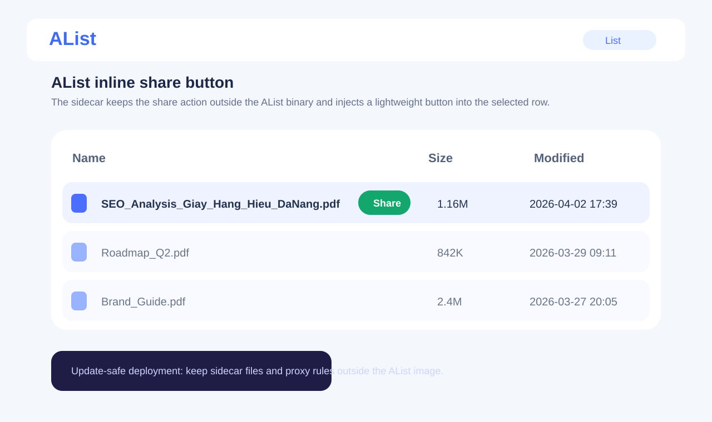
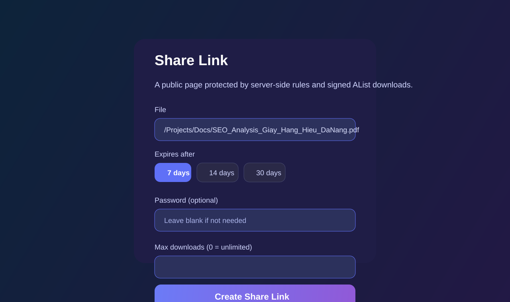
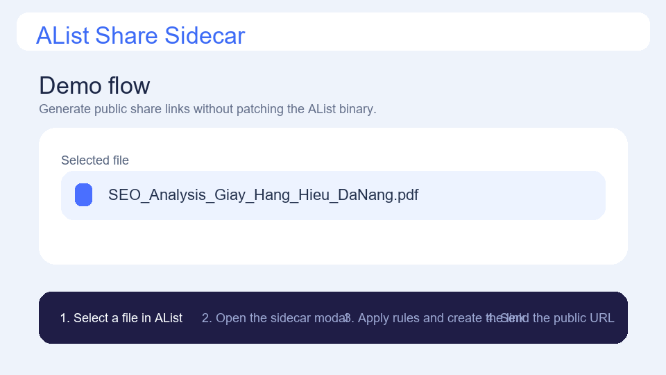

# AList Share Sidecar

Public, update-safe share links for AList without patching the AList binary.

## Visual demo

Illustrative product mockups for the sidecar flow:

Animated flow:

This project adds a small sidecar app beside AList:

- `share-inject.js` adds a share button into the AList UI
- `api.php` creates share links through admin-level AList access
- `download.php` serves public share pages and redirects to signed AList download URLs
- `ShareDB.php` stores share state in SQLite

## Why this exists

AList already handles storage well, but many teams want a single file UI where an authorized user can generate a public share link directly from a mounted storage path.

This sidecar keeps that workflow outside the AList core binary, which makes upgrades easier:

- update AList normally
- keep the sidecar mounted separately
- keep `customize_body` pointing at the injected script
- adjust selectors only if the AList frontend changes

## Security posture

This repository is intentionally clean for public hosting:

- no passwords
- no tokens
- no domains
- no server IPs
- no production database

All sensitive values come from environment variables.

## Architecture

1. A logged-in AList user selects a file in the AList UI.
2. `share-inject.js` sends the file path to `api.php`.
3. `api.php` verifies the viewer token with `/api/me`.
4. `api.php` uses admin credentials from environment variables to resolve the file through AList.
5. The share record is saved in SQLite.
6. Public visitors open `/s/{share_id}`.
7. `download.php` enforces password, expiry, and max-download rules.
8. `download.php` redirects to a signed AList `/d/...?...sign=...` URL when available.

## Requirements

- PHP 8.1+
- SQLite extension for PHP
- cURL extension for PHP
- AList reachable over HTTP from the sidecar
- A reverse proxy or web server that can serve PHP and rewrite `/s/{id}`

## Quick start

1. Copy this project to your web root, for example `/var/www/alist-share`.
2. Copy `.env.example` to `.env` or export the variables through your service manager.
3. Set:
   - `ALIST_API_URL`
   - `ALIST_PUBLIC_URL`
   - `SHARE_BASE_URL`
   - `ALIST_ADMIN_TOKEN` or `ALIST_ADMIN_USERNAME` + `ALIST_ADMIN_PASSWORD`
4. Point your web server to `examples/nginx/share_app.conf` as a starting reference.
5. Add the contents of `examples/alist/customize_body.html` to AList `customize_body`.
6. Make sure the PHP process can write to the `db/` directory.

## Environment variables

| Variable | Purpose |
| --- | --- |
| `ALIST_API_URL` | Internal URL used by the sidecar to call AList APIs |
| `ALIST_PUBLIC_URL` | Public AList origin used to build signed `/d/...?...sign=...` download links |
| `SHARE_BASE_URL` | Public base URL for generated share pages |
| `SHARE_DB_PATH` | SQLite database path |
| `SHARE_APP_NAME` | UI title for share pages |
| `SHARE_CLEANUP_AFTER_DAYS` | Cleanup threshold for old or expired shares |
| `SHARE_MAX_PROXY_SIZE` | Reserved setting if you later add file proxying |
| `ALIST_ADMIN_TOKEN` | Preferred admin authentication method |
| `ALIST_ADMIN_USERNAME` | Optional fallback if no admin token is provided |
| `ALIST_ADMIN_PASSWORD` | Optional fallback if no admin token is provided |

## Update-safe deployment strategy

This project stays resilient during AList upgrades because it does not patch bundled frontend assets inside the AList container image.

Recommended approach:

- run AList as its own container or service
- run this sidecar from a separate path or container
- inject only `share-inject.js` through `customize_body`
- keep nginx or your proxy rules for `/share-app/` and `/s/` outside the AList image

When AList updates:

- upgrade AList first
- verify the selected-row DOM still matches the injected selector logic
- adjust only `share-inject.js` if the frontend structure changed

## Included examples

- `examples/nginx/share_app.conf`
- `examples/alist/customize_body.html`

These are starting points, not production-ready drop-ins for every environment.

## Validation rules

- `expires_days` must be between `1` and `365`
- password is optional
- `max_downloads = 0` means unlimited
- downloads are counted server-side in SQLite

## CI

GitHub Actions runs:

- PHP syntax lint
- Gitleaks secret scanning

## License

MIT
